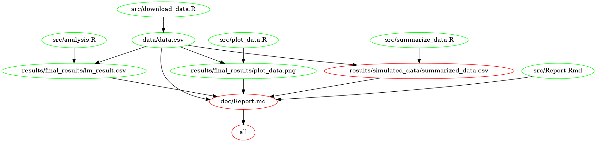

## Milestone_DSCI522

### Reproduction of the Project
The two methods mentioned here can be used to run the project even you do not have all packages needed to run the project. You can choose either method. The other two methods mentioned in the other section "Run the Analysis with All Packages Needed Installed", as indicated by the title, only applicable when you have already installed all packages needed for the project.

#### Option 1: Using Docker

The docker image of this project contains all packages used to produce the results. To run the project using docker, you first need to install docker in your computer. Open docker once it is installed. After this step, clone the project repository into your computer, and remember the path to the repository in your computer. Then, open your Windows PowerShell (for Windows user) or terminal (for Mac user), and type the command below.
```
docker pull tinaqian/milestone
```

After you pull the image successfully, run the code below to link your local project repository to the docker container. In the code below, replace <local-path-to-project-repository> with the real path to your repository.   
```
docker run --rm -v <local-path-to-project-repository>:/home/milestone_DSCI522 tinaqian/milestone /bin/bash
```

Then, you will see something like "root@871e7b5cf2:/#", which means you are already in the docker container. Then type the following code to run the project!

```
# change working directory
cd /home/milestone_DSCI522

# run the Makefile
# If you want to clean all results made before, type:
make clean

# If you want to run the projects, type:
make all
```

#### Option 2: Using Packrat

After you clone the project repository, open the milestone_DSCI522.Rproj file. Once you open the `.Rproj`, type and execute following code in the console (on the left bottom side). The first code helps you install packrat package and the second command restores all packages needed for the projects. After you run the two commands, open and run all Rscripts, and knit `.Rmd` inside the project.

```
# install the packrat package
install.packages("packrat")

# restore all packages needed for the project
packrat::restore()
```

### Project Summary
1. Choose a public dataset from the web that you are interested in to carry out a small data analysis. You may also use any dataset we have previously worked with in MDS.  

    **I use the Iris data set. The data is download from [here](https://gist.githubusercontent.com/curran/a08a1080b88344b0c8a7/raw/d546eaee765268bf2f487608c537c05e22e4b221/iris.csv)**

2. With that dataset, identify a question you would like to ask from it that could be answered by some simple analysis and visualization (e.g., using the Titanic dataset, one might ask if gender played a role in survivorship?)

    **Does species influence the sepal length?**
3. Generate a hypothesis for your question (e.g., using the Titanic dataset, a hypothesis could be that more women survived than men because preference was given to women and children).

    **My hypothesis is that species can influence the sepal length, since different species should have different features.**
4. Suggest how you might summarize the data to show this as a table or a number, as well as how you might show this as a visualization.

    **My data has 5 columns, sepal length in cm, sepal width in cm, petal length in cm, petal width in cm, and species. I will use data in 2 columns, sepal length and species to do a linear regression test to test my hypothesis. The test results, including the p values, will be reported. Also, I will make a boxplot for data visualization. In the plot, each species has box showing the information about the length, and all data points are also plotted. Moreover, the line indicates population mean will be plotted.**

5. The analysis results can be found in the Report.md file under folder "doc". Briefly speaking, the linear regression test shows that the species do have a influence on the sepal length.

### Run the Analysis with All Packages Needed Installed

To do the analysis, you need to open **git bash**/**terminal** and set the root directory of the project as your working directory. Then, you can choose either use a Makefile **or** run 5 Rscripts in order, to produce results of the project.   

##### Using the Makefile

The Makefile is provided in the root directory, after open your git bash/terminal, you may first want to run following code to clean results already existed in the repository.
```
make clean
```
Then, you can run the code below to reproduce all the results and find the final report of the project under folder "doc".
```
make all
```

##### Makefile dependency graph



##### Running Scripts Step by Step

All the `.R` and `.Rmd` files are in the folder "src".  The first one `.R` file to run is "download_data.R". As suggested by the name, it downloads data from the internet, and the save the data locally under the folder "data". The code used to run the script in git bash is show below.
```
Rscript src/download_data.R
```

Second, you run the "summarize_data.R". The script helps to select the data we want. It reads the `.csv` file stored under folder "data" and stores the summarized data in the folder "simulated_data" under folder "results".
```
Rscript src/summarize_data.R
```

Third, you run the "plot_data.R". The input is the summarized data and output is a plot of data.

```
Rscript src/plot_data.R
```
Then, you run the "analysis.R". The input is the summarized data and output is a summary table of the linear regression test performed.

```
Rscript src/analysis.R
```
Last, you knit the `.Rmd` file stored in the src folder and keep the knitted `.md` file under folder "doc" by running the code shown below in git bash.
```
Rscript -e "knitr::knit(input='src/Report.Rmd',output = 'doc/Report.md')"
```
