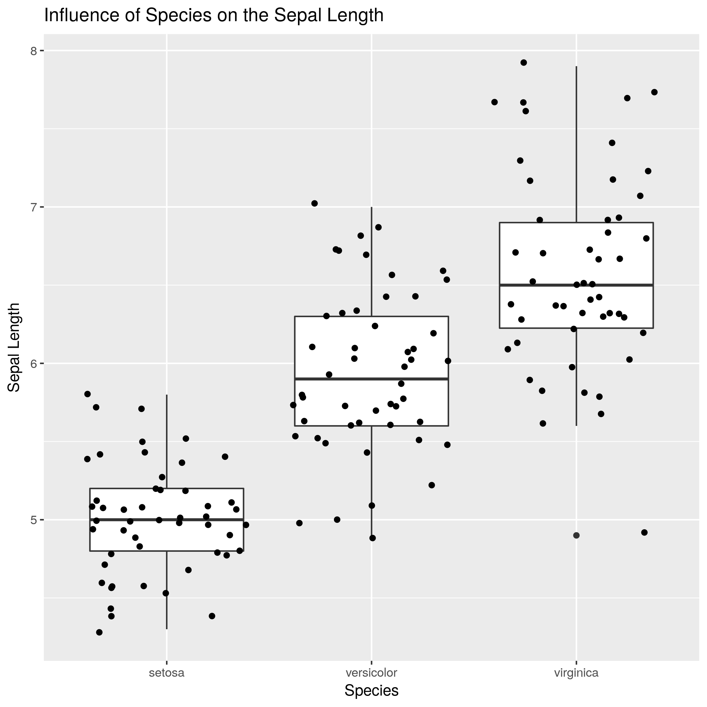

### Question and Hypothesis
By using the Iris dataset published online, I try to study if species influences the sepal length. Personally, I think species can influence the sepal length, since different species should have different features. To test my hypothesis, I run a linear regression test among the categorical varaible "species" and the continuous variable "sepal length", where the null hypothesis is that species has no influence on the sepal length.


### Original Data

The Iris dataset is download from the internet. The structure of the data is shown below. 

```
##   sepal_length sepal_width petal_length petal_width species
## 1          5.1         3.5          1.4         0.2  setosa
## 2          4.9         3.0          1.4         0.2  setosa
## 3          4.7         3.2          1.3         0.2  setosa
## 4          4.6         3.1          1.5         0.2  setosa
## 5          5.0         3.6          1.4         0.2  setosa
## 6          5.4         3.9          1.7         0.4  setosa
```

```
## 'data.frame':	150 obs. of  5 variables:
##  $ sepal_length: num  5.1 4.9 4.7 4.6 5 5.4 4.6 5 4.4 4.9 ...
##  $ sepal_width : num  3.5 3 3.2 3.1 3.6 3.9 3.4 3.4 2.9 3.1 ...
##  $ petal_length: num  1.4 1.4 1.3 1.5 1.4 1.7 1.4 1.5 1.4 1.5 ...
##  $ petal_width : num  0.2 0.2 0.2 0.2 0.2 0.4 0.3 0.2 0.2 0.1 ...
##  $ species     : Factor w/ 3 levels "setosa","versicolor",..: 1 1 1 1 1 1 1 1 1 1 ...
```
### Simulated Data 

Since I am only interested in the species' influence on sepal length, I exclude other irrelevant attributes here. After the cleaning, the data looks like:


```
##   X sepal_length species
## 1 1          5.1  setosa
## 2 2          4.9  setosa
## 3 3          4.7  setosa
## 4 4          4.6  setosa
## 5 5          5.0  setosa
## 6 6          5.4  setosa
```

```
## 'data.frame':	150 obs. of  3 variables:
##  $ X           : int  1 2 3 4 5 6 7 8 9 10 ...
##  $ sepal_length: num  5.1 4.9 4.7 4.6 5 5.4 4.6 5 4.4 4.9 ...
##  $ species     : Factor w/ 3 levels "setosa","versicolor",..: 1 1 1 1 1 1 1 1 1 1 ...
```


### Data Visualization




### Statistical Summaries of the Linear Regression Test

```r
summary<-read.csv("../results/final_results/lm_result.csv",header = T)
summary
```

```
##   X              term estimate  std.error statistic       p.value
## 1 1       (Intercept)    5.006 0.07280222 68.761639 1.134286e-113
## 2 2 speciesversicolor    0.930 0.10295789  9.032819  8.770194e-16
## 3 3  speciesvirginica    1.582 0.10295789 15.365506  2.214821e-32
```


### Analysis Result
As shown in the plot above, the means of sepal length among the three species are quite different. According to the statistical summary table, species "setosa" has a mean sepal length of 5.006, the estimate in line 1. The p values shown in line 2 and line 3 are smaller than 0.05, so we reject the null hypothesis, indicating the difference of mean sepal length between "setosa" and "versucolor"/"virginica" is not zero. Therefore, I conclude that species do have an influence on the sepal length.    
